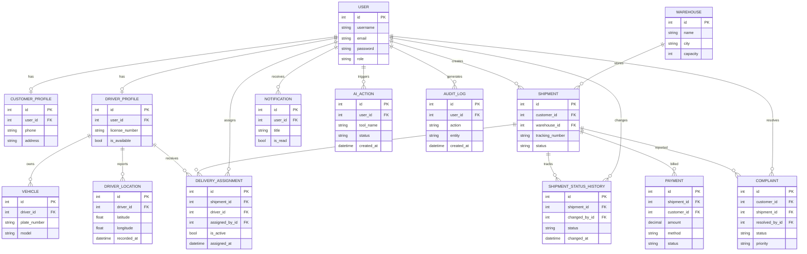

# Entity Relationship Diagram (ERD)

## Delivera — Smart Delivery. Smarter Logistics.

**Version:** 1.0
**Status:** Active
**Database:** PostgreSQL
**ORM:** Django ORM

---

## 1. Database Overview

Delivera uses **PostgreSQL** as its primary database, managed through the **Django ORM**. The schema is organized around the main Django apps:

- `accounts` — Users, CustomerProfile, DriverProfile
- `drivers` — Vehicle, DriverLocation
- `warehouses` — Warehouse
- `shipments` — Shipment, DeliveryAssignment, ShipmentStatusHistory
- `payments` — Payment
- `complaints` — Complaint
- `notifications` — Notification
- `ai_agent` — AIAction
- `analytics` — AuditLog

**Key design principle:** A `Shipment` does **not** contain a direct driver field. Driver assignment is handled exclusively through `DeliveryAssignment`, enabling full assignment history, reassignment, and auditability.

---

## 2. Main Entities

| Entity | App | Purpose |
|--------|-----|---------|
| `User` | accounts | Base authentication entity with role |
| `CustomerProfile` | accounts | Extended data for customers |
| `DriverProfile` | accounts | Extended data for drivers |
| `Vehicle` | drivers | Vehicles owned/used by drivers |
| `DriverLocation` | drivers | Location history of drivers |
| `Warehouse` | warehouses | Storage and routing locations |
| `Shipment` | shipments | Core delivery entity |
| `DeliveryAssignment` | shipments | Driver-to-shipment assignments |
| `ShipmentStatusHistory` | shipments | Full status change trail |
| `Payment` | payments | Payment records per shipment |
| `Complaint` | complaints | Customer complaints |
| `Notification` | notifications | User notifications |
| `AIAction` | ai_agent | AI assistant action log |
| `AuditLog` | analytics | System-wide audit trail |

---

## 3. Entity Fields

### 3.1 User
- **Purpose:** Base authentication and role holder.
- **Fields:** `id`, `username`, `email`, `password`, `role`, `is_active`, `date_joined`
- **Primary Key:** `id`
- **Constraints:** `username` unique, `email` unique, `role` in (`CUSTOMER`, `DRIVER`, `MANAGER`)

### 3.2 CustomerProfile
- **Purpose:** Extended customer information.
- **Fields:** `id`, `user_id`, `phone`, `address`, `created_at`
- **Primary Key:** `id`
- **Foreign Key:** `user_id` → `User.id` (One-to-One)

### 3.3 DriverProfile
- **Purpose:** Extended driver information and availability.
- **Fields:** `id`, `user_id`, `phone`, `license_number`, `is_available`, `created_at`
- **Primary Key:** `id`
- **Foreign Key:** `user_id` → `User.id` (One-to-One)
- **Constraints:** `license_number` unique

### 3.4 Vehicle
- **Purpose:** Vehicle assigned to a driver.
- **Fields:** `id`, `driver_id`, `plate_number`, `model`, `capacity`, `created_at`
- **Primary Key:** `id`
- **Foreign Key:** `driver_id` → `DriverProfile.id`
- **Constraints:** `plate_number` unique

### 3.5 DriverLocation
- **Purpose:** Location history of a driver.
- **Fields:** `id`, `driver_id`, `latitude`, `longitude`, `recorded_at`
- **Primary Key:** `id`
- **Foreign Key:** `driver_id` → `DriverProfile.id`

### 3.6 Warehouse
- **Purpose:** Storage and routing location.
- **Fields:** `id`, `name`, `address`, `city`, `capacity`, `is_active`, `created_at`
- **Primary Key:** `id`
- **Constraints:** `name` unique

### 3.7 Shipment
- **Purpose:** Core delivery entity.
- **Fields:** `id`, `customer_id`, `warehouse_id`, `tracking_number`, `status`, `origin`, `destination`, `weight`, `created_at`, `updated_at`
- **Primary Key:** `id`
- **Foreign Keys:**
  - `customer_id` → `User.id`
  - `warehouse_id` → `Warehouse.id`
- **Constraints:** `tracking_number` unique, `status` in allowed set
- **Note:** **No driver field.** Driver assignment is via `DeliveryAssignment`.

### 3.8 DeliveryAssignment
- **Purpose:** Assigns a driver to a shipment; supports reassignment and history.
- **Fields:** `id`, `shipment_id`, `driver_id`, `assigned_by_id`, `assigned_at`, `is_active`, `notes`
- **Primary Key:** `id`
- **Foreign Keys:**
  - `shipment_id` → `Shipment.id`
  - `driver_id` → `DriverProfile.id`
  - `assigned_by_id` → `User.id`
- **Constraints:** Only one `is_active = True` per shipment.

### 3.9 ShipmentStatusHistory
- **Purpose:** Full trail of shipment status transitions.
- **Fields:** `id`, `shipment_id`, `status`, `changed_by_id`, `changed_at`, `notes`
- **Primary Key:** `id`
- **Foreign Keys:**
  - `shipment_id` → `Shipment.id`
  - `changed_by_id` → `User.id`

### 3.10 Payment
- **Purpose:** Payment record for a shipment.
- **Fields:** `id`, `shipment_id`, `customer_id`, `amount`, `method`, `status`, `created_at`, `updated_at`
- **Primary Key:** `id`
- **Foreign Keys:**
  - `shipment_id` → `Shipment.id`
  - `customer_id` → `User.id`
- **Constraints:** `method` in (`CASH`, `CARD`, `ONLINE`), `status` in (`PENDING`, `PAID`, `FAILED`, `REFUNDED`, `CANCELLED`)

### 3.11 Complaint
- **Purpose:** Customer complaint on a shipment.
- **Fields:** `id`, `customer_id`, `shipment_id`, `subject`, `description`, `status`, `priority`, `resolved_by_id`, `created_at`, `updated_at`
- **Primary Key:** `id`
- **Foreign Keys:**
  - `customer_id` → `User.id`
  - `shipment_id` → `Shipment.id`
  - `resolved_by_id` → `User.id` (nullable)
- **Constraints:** `status` in (`OPEN`, `IN_PROGRESS`, `RESOLVED`, `CLOSED`), `priority` in (`LOW`, `MEDIUM`, `HIGH`, `URGENT`)

### 3.12 Notification
- **Purpose:** User notifications for system events.
- **Fields:** `id`, `user_id`, `title`, `message`, `is_read`, `created_at`
- **Primary Key:** `id`
- **Foreign Key:** `user_id` → `User.id`

### 3.13 AIAction
- **Purpose:** Logs every AI Assistant tool execution.
- **Fields:** `id`, `user_id`, `tool_name`, `input_data`, `output_data`, `status`, `created_at`
- **Primary Key:** `id`
- **Foreign Key:** `user_id` → `User.id`

### 3.14 AuditLog
- **Purpose:** System-wide audit trail for critical operations.
- **Fields:** `id`, `user_id`, `action`, `entity`, `entity_id`, `metadata`, `created_at`
- **Primary Key:** `id`
- **Foreign Key:** `user_id` → `User.id`

---

## 4. Primary Keys

| Entity | Primary Key |
|--------|-------------|
| User | `id` |
| CustomerProfile | `id` |
| DriverProfile | `id` |
| Vehicle | `id` |
| DriverLocation | `id` |
| Warehouse | `id` |
| Shipment | `id` |
| DeliveryAssignment | `id` |
| ShipmentStatusHistory | `id` |
| Payment | `id` |
| Complaint | `id` |
| Notification | `id` |
| AIAction | `id` |
| AuditLog | `id` |

---

## 5. Foreign Keys

| Entity | Foreign Key | References |
|--------|-------------|------------|
| CustomerProfile | `user_id` | User.id |
| DriverProfile | `user_id` | User.id |
| Vehicle | `driver_id` | DriverProfile.id |
| DriverLocation | `driver_id` | DriverProfile.id |
| Shipment | `customer_id` | User.id |
| Shipment | `warehouse_id` | Warehouse.id |
| DeliveryAssignment | `shipment_id` | Shipment.id |
| DeliveryAssignment | `driver_id` | DriverProfile.id |
| DeliveryAssignment | `assigned_by_id` | User.id |
| ShipmentStatusHistory | `shipment_id` | Shipment.id |
| ShipmentStatusHistory | `changed_by_id` | User.id |
| Payment | `shipment_id` | Shipment.id |
| Payment | `customer_id` | User.id |
| Complaint | `customer_id` | User.id |
| Complaint | `shipment_id` | Shipment.id |
| Complaint | `resolved_by_id` | User.id |
| Notification | `user_id` | User.id |
| AIAction | `user_id` | User.id |
| AuditLog | `user_id` | User.id |

---

## 6. Constraints

- **Unique:** `User.username`, `User.email`, `DriverProfile.license_number`, `Vehicle.plate_number`, `Warehouse.name`, `Shipment.tracking_number`.
- **Enum-like:** `User.role`, `Shipment.status`, `Payment.method`, `Payment.status`, `Complaint.status`, `Complaint.priority`.
- **Business rule:** Only one active `DeliveryAssignment` per `Shipment` (`is_active = True`).
- **Referential integrity:** All foreign keys enforced by Django ORM and PostgreSQL.

---

## 7. Relationships

- `User` → `CustomerProfile` (1:1)
- `User` → `DriverProfile` (1:1)
- `User` → `Shipment` (1:N, as customer)
- `User` → `Notification` (1:N)
- `User` → `AIAction` (1:N)
- `User` → `AuditLog` (1:N)
- `DriverProfile` → `Vehicle` (1:N)
- `DriverProfile` → `DriverLocation` (1:N)
- `DriverProfile` → `DeliveryAssignment` (1:N)
- `Warehouse` → `Shipment` (1:N)
- `Shipment` → `DeliveryAssignment` (1:N)
- `Shipment` → `ShipmentStatusHistory` (1:N)
- `Shipment` → `Payment` (1:N)
- `Shipment` → `Complaint` (1:N)
- `DeliveryAssignment` → `DriverProfile` (N:1)
- `DeliveryAssignment` → `Shipment` (N:1)
- `DeliveryAssignment` → `User` (N:1, assigned_by)
- `Complaint` → `User` (N:1, customer)
- `Complaint` → `Shipment` (N:1)
- `Complaint` → `User` (N:1, resolved_by)

---

## 8. Cardinalities

| Relationship | Cardinality |
|--------------|-------------|
| User — CustomerProfile | 1 : 1 |
| User — DriverProfile | 1 : 1 |
| User — Shipment | 1 : N |
| User — Notification | 1 : N |
| User — AIAction | 1 : N |
| User — AuditLog | 1 : N |
| DriverProfile — Vehicle | 1 : N |
| DriverProfile — DriverLocation | 1 : N |
| DriverProfile — DeliveryAssignment | 1 : N |
| Warehouse — Shipment | 1 : N |
| Shipment — DeliveryAssignment | 1 : N |
| Shipment — ShipmentStatusHistory | 1 : N |
| Shipment — Payment | 1 : N |
| Shipment — Complaint | 1 : N |

---

## 9. Important Database Design Decisions

1. **No direct driver field on Shipment.**
   Driver assignment is handled exclusively via `DeliveryAssignment`, enabling:
   - Assignment and reassignment.
   - Full assignment history.
   - Tracking who assigned the driver (`assigned_by`).
   - Tracking assignment timestamps.
   - Preserving previous assignments.

2. **Single active assignment rule.**
   Only one `DeliveryAssignment` per shipment may have `is_active = True` at a time.

3. **Full status history.**
   `ShipmentStatusHistory` records every transition with actor and timestamp.

4. **AI actions are logged separately from audit logs.**
   `AIAction` captures AI tool execution; `AuditLog` captures system-wide critical operations.

5. **Role stored on User.**
   No separate role table. Role is an enum field on `User`.

6. **No `common` app.**
   Each domain owns its entities inside its Django app.

7. **PostgreSQL + Django ORM.**
   All constraints and relationships are enforced at the ORM level and reflected in PostgreSQL.

---

## 10. Mermaid ER Diagram

